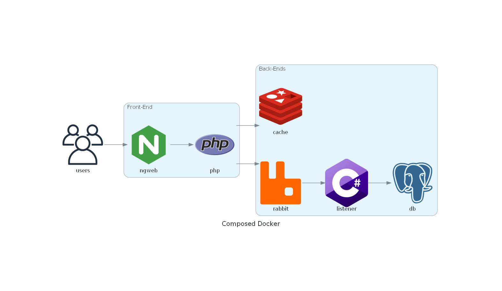

# Docker compose

This repository is a multi-language, muli-component docker compose example.



- Nginx + PHP
- RabbitMQ
- Redis (currently unused)
- Dotnet6: rabbit listener and postgres write 
- Postgresql

## How to run 
Add hosts to your "C:\Windows\System32\drivers\etc\hosts" file

run ```build.bat``` to build the services docker images

run ```docker compose up```

browse to http://dev.local:8080

## Nginx with local PHP

## Rabbitmq

http://dev.local:15672
user guest
pass guest

## Postgresql 

Connecting to the postgres instance and checking the instance

psql -h localhost -p 5432 -U postgres -W

## Architecture 

The diagram is generated by the python module [diagrams](https://diagrams.mingrammer.com/). 